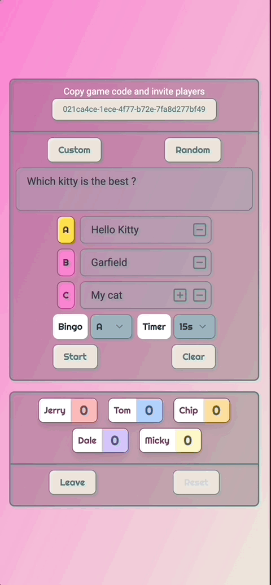
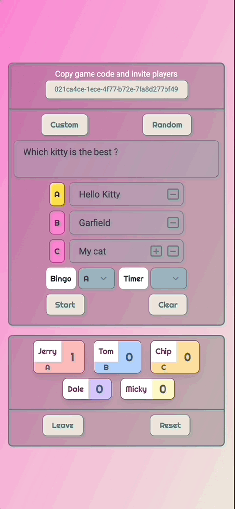
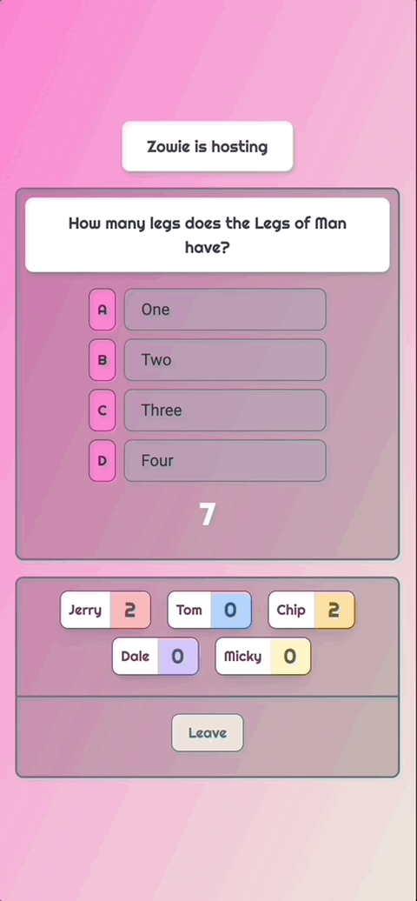

# Quiz Party

A quiz app that allows multi game rooms and multi players within a game room at the same time. If you are looking for a game for party drink forfeit, this is what you need.





## Main Features

- A user can either host a game (master) or join a game by game code (shared by master)
- Host is able to copy game code and share with other player(s)
- Host is able to make custom quiz or pick up a random quiz that suggested by the system
- Host can also set up the timer (interval every 5 seconds from 10s up to a minute)
- Player can choose and readjust the answer before the timer is up
- If a player selected the right answer, the player will be added as one score to the win counts
- Host is able to reset all the players' score and start over a new count.
- If master left, the game will be announced over. If a player left, the player will be removed from player's list.
- Different game rooms are completely isolated.
- All aboves happen in real time.

## Main Technologies

- Vue 3
- Socket.io Client
- TailwindCss
- Docker

## How to start

1. This project requires this [repo](https://github.com/Zowie0122/quiz_party_api) which is the API, please follow the [instruction](https://github.com/Zowie0122/quiz_party_api/blob/main/README.md) to start the backend server first.

2. Copy the environment variable to `.env` from `.env.example` by

```
cat .env.example >> .env
```

3. Please install [Docker](https://www.docker.com/products/docker-desktop/) if you hasn't, don't worry, it is still free 😆 !

4. Make sure your Docker is up and running and host machine and docker environment are all available for port: `8080`. Then run

```
make restart
```

5. Go to `http://localhost:8080/` to start your game.

6. To stop the container, run

```
make down
```

For more come in handy commands, please refer to [Makefile](./Makefile)

✨✨✨✨✨✨Welcome any ideas to make this project better! Happy Coding 👩🏻‍💻✨✨✨✨✨✨
